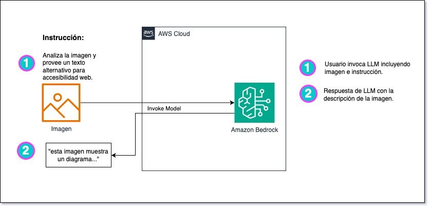

# Potencie la accesibilidad e inclusión web con IA Generativa en Amazon Bedrock
_Enrique Rodriguez, Senior Solutions Architect, Amazon Web Services_

En el mundo digital actual, la accesibilidad es clave para garantizar una experiencia inclusiva para todos. Sin embargo, a menudo se pasa por alto la necesidad de considerar a las personas con discapacidades visuales. ¿Cómo podemos aprovechar la tecnología para hacer que nuestro contenido en línea sea más accesible? 

En este post, explorarás cómo utilizar la IA Generativa en [Amazon Bedrock](https://aws.amazon.com/es/bedrock/) analizando imágenes y textos para mejorar la experiencia de quienes utilizan lectores de pantalla o tienen dificultades para procesar información visualmente.

[Amazon Bedrock](https://aws.amazon.com/es/bedrock/) es un servicio totalmente administrado que ofrece una selección de modelos fundacionales de empresas líderes en IA y de Amazon a través de una única API, junto con un amplio conjunto de capacidades para crear aplicaciones de IA generativa con seguridad, privacidad e IA responsable. 

Cabe destacar que Claude 3 (el modelo más avanzado de Anthropic) se encuentra disponible en Amazon Bedrock y ofrece capacidades multimodales que permiten analizar tanto imágenes como texto de manera simultánea. Puede Conocer más de Anthropic Claude 3 en este [Anuncio](https://aws.amazon.com/es/blogs/machine-learning/unlocking-innovation-aws-and-anthropic-push-the-boundaries-of-generative-ai-together/)

## Introducción 

De acuerdo a los [lineamientos de accesibilidad del contenido web](https://www.w3.org/WAI/GL/UNDERSTANDING-WCAG20/) (WCAG, por sus siglas en inglés), los Cuatro Principios de Accesibilidad indican que para que cualquier persona pueda acceder y usar el contenido web, este debe ser : **Perceptible** (no puede ser invisible para todos sus sentidos), **Operable** (la interfaz no puede requerir interacciones que un usuario no pueda realizar), **Comprensible.** (el contenido u operación no puede estar más allá de su comprensión) y **Robusto** (se debe poder interpretar por una amplia variedad de agentes de usuario, incluyendo tecnologías de asistencia)

Si alguno de estos principios no se cumple, las personas con discapacidades no podrán utilizar la web en su totalidad.

A continuación usarás diferentes técnicas para mejorar la accesibilidad del contenido web utilizando Modelos de Lenguaje Grandes (En adelante LLMs, por sus siglas en inglés).

## Descripción General

En el siguiente diagrama se muestra en general como utilizarás el servicio Amazon Bedrock 



Para todos los casos usarás este tipo de invocación en tiempo real, los diferentes resultados serán sólo cambiando la instrucción y el mensaje.


## Paso a paso

### Requisitos previos

Para ejecutar localmente esta guía, necesitarás los siguientes requisitos previos:

- Una [Cuenta de AWS](https://docs.aws.amazon.com/accounts/latest/reference/welcome-first-time-user.html#getting-started-step1)
- Un usuario de [Identity and Access Management (IAM)](http://aws.amazon.com/iam) con [permisos para invocar los modelos (Bedrock:InvokeModel)](https://docs.aws.amazon.com/bedrock/latest/userguide/security_iam_id-based-policy-examples.html#security_iam_id-based-policy-examples-console)
- [Interfaz de linea de comandos AWS](https://docs.aws.amazon.com/cli/latest/userguide/getting-started-install.html)
- [Python](https://www.python.org/downloads/) y [boto3](https://boto3.amazonaws.com/v1/documentation/api/latest/guide/quickstart.html)
- [Acceso al modelo Anthropic Claude 3](https://docs.aws.amazon.com/bedrock/latest/userguide/model-access.html)

Cabe destacar que este post no requiere despliegue de infraestructura.

## Análisis de Imagen con Anthropic Claude 3 en Amazon Bedrock

El codigo base que analiza la imagen se encuentra a continuación.

1. Crea un archivo `get_alt_text.py` con lo siguiente:

```python
import json
import boto3
import base64
import argparse

# crear un cliente bedrock-runtime para invocar el modelo 
bedrock = boto3.client("bedrock-runtime")
modelId = 'anthropic.claude-3-sonnet-20240229-v1:0'
accept = 'application/json'
contentType = 'application/json'

# obtener el archivo imagen desde argumento  
parser = argparse.ArgumentParser()
parser.add_argument("image_path")
args = parser.parse_args()
image_path = args.image_path

# Lee el contenido del archivo imagen y lo codifica en base64 para enviarlo al modelo.
with open(image_path, "rb") as image_file:
    content_image = base64.b64encode(image_file.read()).decode('utf8')

# Crea un mensaje para el modelo, el rol es 'user' y solo un contenido: la imagen
message = {
    "role": "user",
    "content": [
        {
            "type": "image", 
            "source": { "type": "base64", "media_type": "image/jpeg", "data": content_image}
        }
    ]
}

# La instrucción del modelo para analizar la imagen y obtener un texto alternativo.
system_prompt = """Tu eres un revisor de articulos web que van a ser publicados. 
Tu labor es ver las imágenes y proporcionar un texto alternativo (que se incluirá 
como atributo 'alt' para la etiqueta img) que describa su contenido. 
Responde en 150 caracteres o menos sin preámbulo"""


# Invoca el modelo y obtiene el texto alternativo
body = {
    "system": system_prompt,
    "messages":[message],
    "anthropic_version":"bedrock-2023-05-31",
    "max_tokens":50, "temperature":0
}

response = bedrock.invoke_model(
    body=json.dumps(body), 
    modelId=modelId, accept=accept, contentType=contentType)

response_body = json.loads(response.get('body').read())
alt_text = response_body.get("content")[0].get("text")

# muestra el resultado
print({"image":image_path, "alt_text":alt_text})
```

2. Ejecuta el código con una imagen (puedes usar [esta imagen de prueba](samples/sample_diagram.jpg)) y obtendrás el resultado de texto alternativo:


```zsh
❯ python3 get_alt_text.py samples/sample_diagram.jpg
```
>_Diagrama que muestra el flujo de trabajo de un servicio de reconocimiento de imágenes en la nube AWS, donde el usuario envía una imagen y recibe una descripción textual generada por un modelo_

## Análisis Contextualizado de la Imagen

El contexto en el que se encuentra la imagen puede modificar el significado o la interpretación del texto alternativo. Por lo tanto, el texto alternativo debe ser descriptivo y proporcionar información relevante sobre el contenido y **la función de la imagen dentro del contexto específico en el que se encuentra**.

Para aprovechar el contexto agrega el texto previo y posterior a la imagen. En términos prácticos modifica la llamada para agregar el texto previo y posterior, como en este caso:

```python 

previous_text = "En la imagen se muestra el uso de LLM para entender las imagenes dentro del texto y proveer buqueda más relevante en Bases de Datos Vectoriales."

following_text = "Ahora veamos el caso donde un usuario quiera encontrar documentos donde se muestra la invocación a bedrock"


message = {
    "role": "user",
    "content": [ 
        # texto previo
        {"type":"text","text":previous_text},
        {
            "type": "image", 
            "source": {
                "type": "base64", 
                "media_type": "image/jpeg", 
                "data": content_image
            }
        },
        # texto posterior
        {"type":"text","text":following_text}
    ]
}


# Nueva instrucción: considerar contexto
system_prompt = "Tu eres un revisor de articulos web que van a ser publicados, tu misión es ver las imágenes y leer el texto previo y posterior para proporcionar un texto alternativo (que se incluirá como atributo 'alt' para la etiqueta img) que describa su contenido. Considera el texto que viene antes y después de la imagen al momento de generar la descripción. Responde en 150 caracteres o menos sin preámbulo"

```

Observa que el resultado cambia, por el nuevo contexto:

```bash
❯  python3 get_alt_text_context.py samples/sample_diagram.jpg
```
>_Diagrama que muestra el flujo de invocación de un modelo de lenguaje grande (LLM) en AWS Cloud para generar una descripción de una imagen, utilizada para búsquedas más relevantes en bases de datos vectoriales._

## Bonus track: Revisar el contenido en busca de contenido no inclusivo

Al crear contenido en línea, podríamos escribir de manera poco accesible, utilizando colores difíciles de distinguir para los daltónicos o haciendo referencia a posiciones en el texto que no son entendibles para todos. A continuación muestro algunos ejemplos:

| Incorrecto | Correcto | ¿Por que? |
| --- | --- | --- |
| En la imagen vemos | En el diagrama a continuación se muestra | No es inclusivo para personas que usan lectores de pantalla y no saben la ubicación de la imagen |
| Colores confusos para daltonismo (ej: verde, rojo) | Usar colores con diferente constraste (Ej: amarillo, rojo) <br/>Etiquetas Textuales para quienes no ven los colores| No es inclusivo para daltónicos o ciegos |
| en el menú opciones, **haz click** en 'Opcion A' | en el menú opciones, **selecciona** la 'Opción A' | no todos usan mouse/trackpad para navegar en la interfaz

Afortunadamente puedes mejorar el análisis  modificando la instrucción de la llamada de API. Manteniendo la estructura anterior modifica la instrucción de forma: 

```python
system_prompt = """Tu eres un revisor de articulos web que van a ser publicados, tu misión es ver las imágenes y leer el texto para encontrar contenido web no inclusivo para personas con discapacidad visual. A continuación te muestro algunos ejemplos:

Ejemplo de escritura no inclusiva:
Incorrecto: 'Como se puede ver en la imagen de arriba, el proceso inicia...' 
Corrección: 'En el diagrama anterior, el proceso inicia...'

Ejemplo de imagen no inclusiva:
Incorrecto: (usando una imagen con colores rojo y verde) 'El color rojo representa un sistema alarmado, y el verde el sistema saludable'
Correcto: (usando una imagen con colores rojo y amarillo y etiquetas de texto para cada color) 'Acá se muestra el sistema alarmado y el sistema saludable'
"""

```
(también cambia max_tokens:500 para recibir la recomendación completa)

Nota: Esta técnica se conoce como [Few Shot Prompting](https://www.promptingguide.ai/es/techniques/fewshot), que consiste en dar algunos ejemplos al modelo en la misma instrucción.

Y el resultado del análisis:

```sh
❯ python3 analize_visual_inclusion.py samples/sample_alarm.jpg
```

>_La descripción "En la imagen de abajo se ve las diferentes alarmas del sistema" no es inclusiva para personas con discapacidad visual, ya que asume que el lector puede ver la imagen. Una descripción más inclusiva sería:<br/><br/>La imagen muestra dos círculos de colores, uno rojo y otro verde, que representan diferentes tipos de alarmas del sistema.<br/><br/> Sin embargo, no se proporcionan etiquetas de texto que indiquen qué significa cada color, lo cual dificultaría la comprensión para personas con discapacidad visual. Una mejor práctica sería incluir una leyenda o etiquetas de texto que describan el significado de cada color.'_

Excelente análisis

## Conclusiones

En este post, aprendiste cómo utilizar la IA Generativa en Amazon Bedrock para mejorar la accesibilidad e inclusión del contenido web, especialmente para personas con discapacidades visuales. Descubriste cómo generar descripciones alternativas precisas para imágenes, teniendo en cuenta el contexto del texto circundante, y cómo analizar el contenido para identificar y corregir elementos no inclusivos.

Estas técnicas pueden ser útiles no solo para sitios web, sino también para cualquier contenido digital que contenga imágenes, como documentos, presentaciones o material de marketing. Además, el análisis de inclusión puede extenderse más allá de las discapacidades visuales, para considerar otros tipos de discapacidades y barreras de accesibilidad.

Las capacidades multimodales de Claude 3 permiten combinar imágenes y texto como input del modelo, lo que abre un abanico de posibilidades. Algunas aplicaciones que podrían desarrollarse aprovechando esta funcionalidad incluyen herramientas de análisis de imágenes más avanzadas, donde Claude podría proporcionar descripciones detalladas y contextualizadas de lo que ve en las imágenes.

Si deseas profundizar en estos temas, puedes consultar los siguientes recursos:


- [Las pautas de accesibilidad web (WCAG) de la W3C](https://www.w3.org/WAI/standards-guidelines/wcag/)
- [Amazon Bedrock](https://aws.amazon.com/es/bedrock/developer-experience/) 
- Si estas interesado en una actividad practica te recomendamos [Building with Amazon Bedrock and LangChain](https://catalog.workshops.aws/building-with-amazon-bedrock/en-US)
- Revisa otras publicaciones de estos temas en el [Blog IA Generativa en AWS](https://aws.amazon.com/es/blogs/machine-learning/category/artificial-intelligence/generative-ai/)

¿Tienes alguna pregunta o experiencia adicional sobre el uso de IA Generativa? Comparte tus comentarios a continuación.
